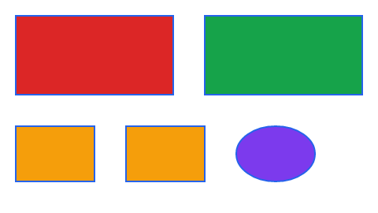
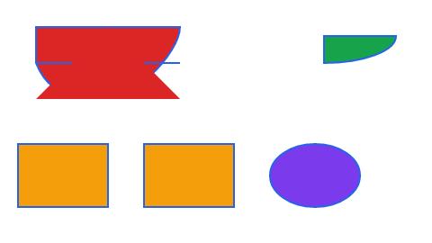

`custom-geometry.pptx` is a generated, text-free regression deck licensed with this repository.

Slide 1 contains two targeted shapes and three controls. Slide 2 contains only presets.

| Shape | Before | After |
| --- | --- | --- |
| Mixed paths, box `(20,20,200,100)` px | Red rectangle with blue outline | Four independent paths, with line, cubic, quadratic and close commands |
| Quarter ellipse, box `(260,20,200,100)` px | Green rectangle with blue outline | Elliptical arc from `(440,40)` to `(360,70)` px, then line and close |
| Missing path list / unresolved guide | Amber rectangles | Identical fallback rectangles |
| Preset ellipse | Purple ellipse | Identical preset path |

The mixed shape's first path uses a `200 × 100` coordinate space against a `1905000 × 952500` EMU transform. Its first points normalize to `(0.1,0.1)` and `(0.9,0.1)`, which render at `(40,30)` and `(200,30)` px. Its remaining paths use `400 × 200`, `100 × 50`, and `200 × 100` spaces. Their paints are respectively stroke only, fill only, and neither. The fill is `#DC2626`; the stroke is `#2563EB`, 2 px wide.

The quarter ellipse uses radii `(80,30)` in a `200 × 100` path space and a 90-degree sweep. Its normalized cubic controls are `(0.9,0.3656854249492381)` and `(0.7209138999323174,0.5)`, with endpoint `(0.5,0.5)`.

The before image and version-2 update fixture were generated using `origin/main` at `387f2392`, opening this deck with client ID 285. The update is stored at `crates/pptx-edit/tests/fixtures/deck-custom-schema-v2.update.bin`. It contains the old parsed model without custom paths and exercises migration to version 3. Restoring an old update without source bytes retains its historical fallback geometry; attaching the original deck reparses the custom paths.

The parser uses the same normalized command representation and 2,048-command bound as the DOCX custom-geometry parser. PPTX preserves individual path painting and rejects an unsupported path as a whole. It converts DrawingML polar angles to ellipse parameters before producing cubic curves; see [Apache POI's DrawingML angle convention](https://github.com/apache/poi/blob/trunk/poi/src/main/java/org/apache/poi/sl/draw/geom/ArcToCommand.java). Guide formulas still use the rectangle fallback.

Isolation against that main revision covers all four tracked decks: the demo and its OPC copy (three slides each), chart-deck (two slides), and this deck (two slides). Nine display lists are byte-identical. Only the two intended shapes on slide 1 change; their other fields, the control shapes, and the display-list contract are unchanged. All four deck snapshot JSON payloads and all three pre-existing package JSON payloads are byte-identical. All 57 ZIP parts remain identical after both parser and editor no-edit saves, on both revisions.

Package and deck snapshot JSON deserialize in both directions. Version-1 and version-2 collaboration updates migrate to version 3. The old engine's version check intentionally rejects version-3 updates.

Mutation verification (each mutation failed a running test, then passed after restoring production code):

| Mutation | Test filter | Result |
| --- | --- | --- |
| `normalization` | `a_custom_geometry_becomes_a_path_normalised_to_the_shape` | Red → restored green |
| `cubic-control` | `a_custom_geometry_becomes_a_path_normalised_to_the_shape` | Red → restored green |
| `quadratic-control` | `paths_use_independent_spaces_and_paint_flags` | Red → restored green |
| `arc-fallback` | `arcs_preserve_ellipse_angles_direction_and_current_point` | Red → restored green |
| `ellipse-angle` | `arcs_preserve_ellipse_angles_direction_and_current_point` | Red → restored green |
| `arc-direction` | `arcs_preserve_ellipse_angles_direction_and_current_point` | Red → restored green |
| `close-current` | `arcs_preserve_ellipse_angles_direction_and_current_point` | Red → restored green |
| `path-fill` | `paths_use_independent_spaces_and_paint_flags` | Red → restored green |
| `path-stroke` | `paths_use_independent_spaces_and_paint_flags` | Red → restored green |
| `partial-fallback` | `invalid_paths_fall_back_as_a_whole_and_expansion_is_bounded` | Red → restored green |
| `command-budget` | `invalid_paths_fall_back_as_a_whole_and_expansion_is_bounded` | Red → restored green |
| `preset-parse` | `presets_keep_priority_over_custom_geometry` | Red → restored green |
| `snapshot-dispatch` | `custom_paths_keep_coordinates_paints_and_fallbacks` | Red → restored green |
| `inherited-dispatch` | `layout_and_master_paths_survive_snapshot_hydration` | Red → restored green |
| `render-fill` | `custom_paths_keep_coordinates_paints_and_fallbacks` | Red → restored green |
| `render-stroke` | `custom_paths_keep_coordinates_paints_and_fallbacks` | Red → restored green |
| `render-budget` | `custom_paths_share_the_slide_shape_budget` | Red → restored green |
| `serde-default` | `custom_paths_persist_without_changing_legacy_json_or_source_parts` | Red → restored green |
| `serde-skip` | `custom_paths_persist_without_changing_legacy_json_or_source_parts` | Red → restored green |
| `schema-version` | `released_v` | Red → restored green |
| `schema-migration` | `released_v2_snapshot_migrates_once_without_losing_shapes` | Red → restored green |
| `multiple-paths` | `paths_use_independent_spaces_and_paint_flags` | Red → restored green |
| `preset-render` | `custom_paths_keep_coordinates_paints_and_fallbacks` | Red → restored green |
| `normalized-finite` | `invalid_paths_fall_back_as_a_whole_and_expansion_is_bounded` | Red → restored green |
| `arc-budget` | `invalid_paths_fall_back_as_a_whole_and_expansion_is_bounded` | Red → restored green |
| `guide-fallback` | `a_custom_geometry_becomes_a_path_normalised_to_the_shape` | Red → restored green |
| `future-schema` | `unmigratable_schema_versions_stay_rejected` | Red → restored green |
| `migration-convergence-version` | `two_clients_migrating_the_same_v1_snapshot_converge` | Red → restored green |
