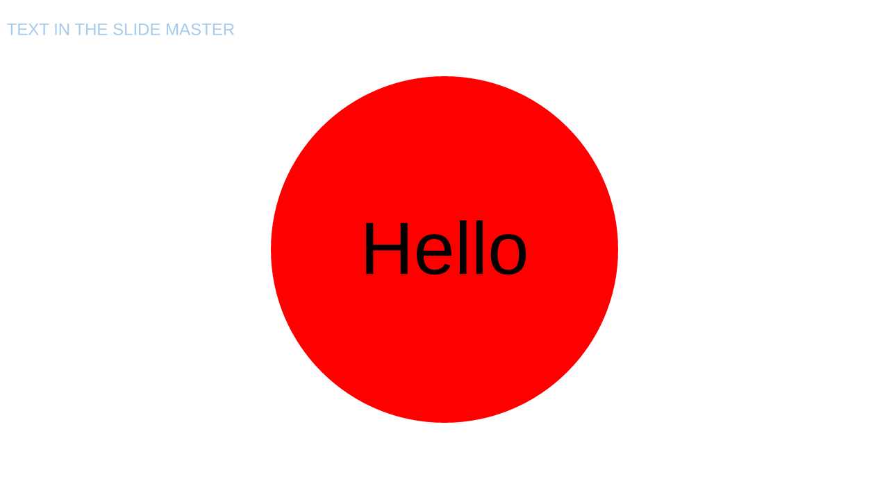
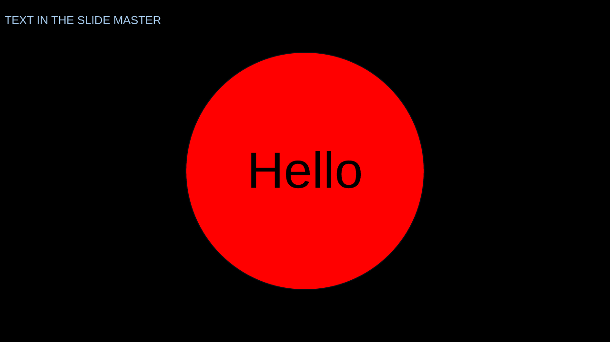

# Theme style reference fixtures

The integration baseline is `origin/main` at `2b639b95`, merged into the verified PR head `d24737aa`. Both builds use that revision's identical lockfile and the same Liberation Sans font. Every slide's `SurfaceDisplayList` is serialized with `serde_json::to_vec` before comparison.

The merges retain alpha-aware paint resolution, group-fill inheritance, picture crops and masks, preset adjustments, connectors, font fallback styling, and line arrowheads from main. `grpFill` is a supported fill rather than an unsupported-fill barrier. Both parents' tests remain present. The first integration with `57980319` retained this PR's schema 3.0 while main was 2.0. PR #273 then landed during verification and advanced main to 3.0, so the final integration uses schema 4.0 with migration from v1, v2 and v3.

`master-style-deck.pptx` is the contributor's original repro. Its master rectangle gains a black fill and a black 2 px outline. The red oval keeps its explicit fill and gains a `#030E13`, 2 px outline. Text, geometry and paths stay unchanged; font reference colours are deferred to PR #283.

| Before | After |
| --- | --- |
|  |  |

`style-matrix-deck.pptx` extends the recovered fixture with distinct style slots, two placeholder colour stops surrounding a literal gradient stop, explicit fill barriers, partial outlines, inherited placeholder properties and picture outlines. Its second slide retains the original inheritance controls.

| Shape | Expected result |
| --- | --- |
| FillRef3 | `#808080`, reference lumMod 50% + lumOff 10%, then style lumMod 50% + lumOff 10% → `#474747` |
| FillRef1001 | Background slot 1, reference transforms followed by lumMod 25% + lumOff 20% → `#4A4A4A` |
| FillRef1002 | Background slot 2 → `#556677` |
| FillRef0, FillRef1000 | No fill |
| Gradient2 | 90° gradient: `#474747` at 0, literal `#123456` at 0.5, `#4A4A4A` at 1 |
| LnRef3 | `#0F9ED5`, 3 px, dashed |
| WidthOnly | Explicit width 4 px, theme colour `#474747` |
| ExplicitLineColour | Explicit `#112233`, theme width 3 px and dash |
| ExplicitFill | Explicit `#112233` |
| ExplicitNoFill, UnsupportedFill, LineSlot2 | No fill or stroke |
| Placeholder50 | Layout fill `#334455`, layout line `#667788` at 8 px, theme dash |
| Placeholder51 | Layout noFill suppresses style fill and outline |
| Placeholder52 | Master fill `#ABCDEF` beats slide/layout style references |
| PictureLine, MasterPictureLine | `#CDEFAB`, 3 px, dashed |
| PhOwnStyle, PhInheritFill | Explicit layout fill `#00FF00` |
| PhInheritStyle | Layout style colour `#4EA72E` |

Fill indices follow [ISO/IEC 29500's fillRef definition](https://learn.microsoft.com/en-us/dotnet/api/documentformat.openxml.drawing.fillreference?view=openxml-3.0.1): 0 and 1000 suppress fill; 1–999 address fillStyleLst; 1001 onward address bgFillStyleLst. Empty style slots retain their index.

The v2 collaboration update in `crates/pptx-edit/tests/fixtures/deck-schema-v2.update.bin` was generated by baseline `387f2392` from the matrix deck, inserting `persisted-v2 ` into the first text story. Migration preserves that edit and the package JSON byte for byte. Newly opened v4 updates retain theme matrices, style references and explicit fill barriers.

The v3 update in `crates/pptx-edit/tests/fixtures/deck-schema-v3-connectors.update.bin` was generated by main at `413499c5`, opening `deck-schema-v2-connectors.pptx` with client ID 9001. Migration preserves its connector source IDs, package JSON, saved file and subsequent round trip. The connector migration tests and both v2 update fixtures remain intact.

The alpha integration test adds 50% alpha to matrix references, then 25% alpha to their theme styles. Solid fills, placeholder gradient stops and partial outlines retain the expected `80` and `40` alpha bytes; the literal gradient stop stays opaque.

Theme line slot 3 retains a triangle head (15 × 6 px) and an oval tail (6 × 15 px). Placeholder50 retains its explicit 8 px outline width, scaling those ends to 40 × 16 px and 16 × 40 px. Pictures retain the same theme-derived ends.

## Isolation

All eight PPTX paths tracked on main at this baseline cover nineteen slides, all byte-identical. Including this PR's two repro fixtures gives ten paths and twenty-two slides. The three repro slides contain 18 changed primitives. Removing only `fill` and `stroke` from those primitives makes the complete display lists identical. Every text run and its colour, every position and geometry path, every image reference, crop and mask, and primitive order is unchanged.

| Fixture | Slides | Byte-identical slides |
| --- | --- | --- |
| `apps/demo/public/betteroffice-demo.pptx` | 3 | 3 |
| `crates/ooxml-drawingml/tests/fixtures/preset-adjustments.pptx` | 3 | 3 |
| `crates/ooxml-opc/tests/fixtures/betteroffice-demo.pptx` | 3 | 3 |
| `crates/pptx-edit/tests/fixtures/deck-schema-v2-connectors.pptx` | 1 | 1 |
| `crates/pptx-edit/tests/fixtures/deck-schema-v2-nested-connectors.pptx` | 1 | 1 |
| `crates/pptx-parse/tests/fixtures/chart-deck.pptx` | 2 | 2 |
| `crates/pptx-render/tests/fixtures/picture-crop-mask.pptx` | 3 | 3 |
| `crates/pptx-render/tests/fixtures/line-ends.pptx` | 3 | 3 |
| `crates/pptx-parse/tests/fixtures/master-style-deck.pptx` | 1 | 0 |
| `crates/pptx-parse/tests/fixtures/style-matrix-deck.pptx` | 2 | 0 |

The eight fixtures from main contain no fill or line style references in their slides, layouts or masters. Ten deck snapshots match byte for byte; all 159 ZIP parts remain byte-identical to the input after no-edit saves on both builds.

## Mutation checks

All 25 mutations below failed an assertion (exit 101), then passed after restoring the source (exit 0) on the final integrated tree. These repeat all 18 original checks and add five for the alpha and group-fill interactions, plus migration from main's v3 schema and theme-derived arrowheads. All mutated source files were restored byte for byte.

| Mutation | Failing regression test | Restored |
| --- | --- | --- |
| fill-index | `style::tests::fill_indices_keep_holes_and_select_background_styles` | PASS |
| line-index | `style::tests::line_indices_preserve_no_fill_slots_and_explicit_style_properties` | PASS |
| fill-1000 | `style::tests::fill_indices_keep_holes_and_select_background_styles` | PASS |
| phclr-substitution | `style::tests::placeholder_modifiers_compose_in_solids_lines_and_every_gradient_stop` | PASS |
| reference-modifiers | `style::tests::placeholder_modifiers_compose_in_solids_lines_and_every_gradient_stop` | PASS |
| gradient-last-stop | `style::tests::placeholder_modifiers_compose_in_solids_lines_and_every_gradient_stop` | PASS |
| style-list-slots | `parses_theme_matrix_slots_references_and_explicit_fill_barriers` | PASS |
| background-list | `parses_theme_matrix_slots_references_and_explicit_fill_barriers` | PASS |
| explicit-no-line | `parses_theme_matrix_slots_references_and_explicit_fill_barriers` | PASS |
| serde-skip-default | `absent_style_fields_deserialize_and_serialize_without_new_defaults` | PASS |
| serde-read-default | `absent_style_fields_deserialize_and_serialize_without_new_defaults` | PASS |
| placeholder-precedence | `placeholder_properties_outrank_shape_and_layout_style_references` | PASS |
| outline-property-merge | `theme_matrix_renders_reference_colours_indices_and_explicit_line_defaults` | PASS |
| master-style-fill | `master_shapes_render_theme_fills` | PASS |
| edited-outline | `edited_outlines_override_the_resolved_style` | PASS |
| schema-version | `released_v2_snapshot_migrates_without_changing_content_or_default_serialization`, `released_v1_snapshot_migrates_and_round_trips_as_v4`, `two_clients_migrating_the_same_v1_snapshot_converge` | PASS |
| v2-migration | `released_v2_snapshot_migrates_without_changing_content_or_default_serialization` | PASS |
| unknown-schema | `unmigratable_schema_versions_stay_rejected` | PASS |
| group-fill-marker | `drawing::tests::group_fill_reaches_every_shape_that_asks_for_it` | PASS |
| group-fill-supported | `a_placeholder_asking_for_a_group_fill_keeps_its_layout_fill` | PASS |
| alpha-resolver | `theme_reference_and_style_alpha_reach_fills_gradients_and_outlines` | PASS |
| reference-alpha | `theme_reference_and_style_alpha_reach_fills_gradients_and_outlines` | PASS |
| style-alpha | `theme_reference_and_style_alpha_reach_fills_gradients_and_outlines` | PASS |
| v3-migration | `released_v3_snapshot_migrates_without_changing_connector_ordinals` | PASS |
| theme-line-ends | `theme_matrix_renders_reference_colours_indices_and_explicit_line_defaults` | PASS |
